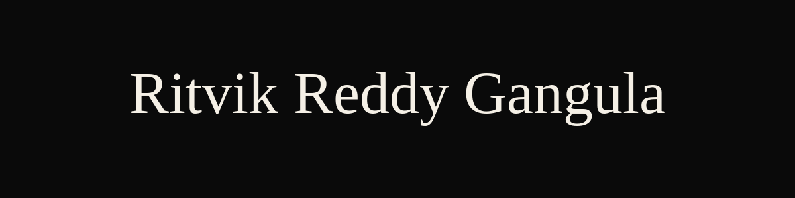

CS student at Arizona State University (4.0 GPA, Dean's List x6), graduating May 2027. AWS Certified Cloud Practitioner (CLF-C02).

## Highlights

- Interned this summer at **GCM Grosvenor**, where I engineered an LLM-powered insights feature on Azure OpenAI (GPT-4o, Azure AI Search) that synthesized client reports across 500+ portfolios at 1.5s median retrieval time, saving 560 hours of team effort per quarter.
- Building **DeltaLedger MCP**, a RAG pipeline over SEC EDGAR filings feeding a three-agent LangGraph system (Aligner, Classifier, Verifier), shipped as an MCP server and REST API on AWS Lambda/Step Functions, validated against a CI-integrated golden eval set.
- Building **Forge**, a distributed job orchestrator in Go implementing Raft consensus for leader election and Kafka-backed event sourcing for crash recovery, recovers 15/15 in-flight jobs with zero data loss and sub-500ms leader failover across 5 induced failures.
- 4.0 GPA at Arizona State University, Dean's List x6.
- AWS Certified Cloud Practitioner (CLF-C02).

## Technical Skills

**Languages**

**Frameworks & Tools**

**Cloud & DevOps**

**Distributed Systems**

**Databases**

**Agentic AI**

## GitHub Stats

